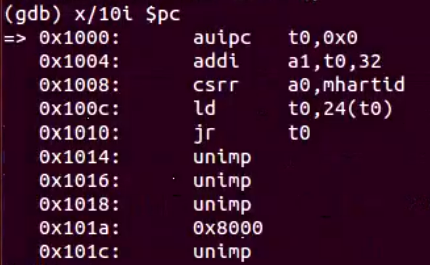

# lab0.5 实验报告
## 练习1：使用 GDB 验证启动流程
+ 题目1：为了熟悉使用qemu和gdb进行调试工作, 使用gdb调试QEMU模拟的RISC-V计算机加电开始运行到执行应用程序的第一条指令（即跳转到0x80200000）这个阶段的执行过程，说明RISC-V硬件加电后的几条指令在哪里？完成了哪些功能？要求在报告中简要写出练习过程和回答。
+ 在启动qemu之后，执行`x/10i $pc`，输出即将执行的10条指令，即RISC-V硬件加电后的几条指令为：

  + `0x1000`：auipc代表 "Add Upper Immediate to PC"，用于生成全局地址。这个指令的主要目的是将一个立即数（20位）左移 12 位并将结果加到当前 PC 寄存器的值上，从而生成一个全局地址。因此这句话的意思是，加载pc的值到t0中。
  + `0x1004`：给t0加上32保存在a1中。
  + `0x1008`：c当执行这条指令时，将当前硬件线程（Hart）的唯一标识符的值读取并存储在寄存器a0中，以便程序可以访问和使用Hart ID，通常用于多核处理器的编程。
  + `0x100c`：将t0+24地址处的值读入t0寄存器中，也就是相对于0x1000偏移24个字节的地址处所存储的值。看到0x101a处刚好存着0x80000000，也就是我们的BootLoader的地址。
  + 执行到0x1010时，跳转到了t0所指向的地址处，观察到跳转到了0x80000000处，也就是在此处跳转到bootloader开始运行。

+ riscv从上电到执行操作内核的第一条指令之间经历了什么？
  1. **硬件初始化：**
     + 电源上电：计算机硬件加电，各组件开始初始化。
     + 处理器初始化：处理器处于初始状态，计算机需要为它分配初始寄存器值和设置合适的控制状态。这通常由硬件固件完成。
     + 复位向量加载：计算机会加载复位向量的地址，这个地址指向启动代码的入口点。这个地址是硬件内部定义的，通常是一个预定义的地址。（在本次实验中，这个复位地位为0x1000）
     + 总的来说，在QEMU模拟的这款riscv处理器中，将复位向量地址初始化为0x1000，再将PC初始化为该复位地址，因此处理器将从此处开始执行复位代码，复位代码主要是将计算机系统的各个组件（包括处理器、内存、设备等）置于初始状态。
  2. **引导加载程序（Bootloader）：**
      + 跳转到复位向量（0x1000）指定的启动入口点后，这里的代码会启动Bootloader。在这里QEMU的复位代码指定bootloader的位置为0x80000000（OpenSBI.bin）。
      + Bootloader将加载操作系统内核并启动操作系统的执行，即kern/init/entry.S是OpenSBI启动之后将要跳转到的一段汇编代码。这段代码作为入口点，作用是分配好内核栈，最终跳向kern_init函数。
  3. **加载操作系统内核：**
     + 跳转到openSBI固件预先导入的ucore内核（os.bin）地址0x80200000处。
     + kern/init/init.c是C语言编写的内核入口点。主要包含kern_init()函数，从kern/entry.S跳转过来完成其他初始化工作，它作为“真正的”内核入口点。
## ucore_lab代码分析
### 链接脚本分析
+ 脚本路径：./tools/kernel.ld
+ 脚本具体内容及注释
```c
/* Simple linker script for the ucore kernel.
   See the GNU ld 'info' manual ("info ld") to learn the syntax. */

OUTPUT_ARCH(riscv)
/* 指定输出文件的指令集架构, 在riscv平台上运行 */
ENTRY(kern_entry)
/* 指定程序的入口点为一个叫做kern_entry的符号，之后会在汇编代码里定义它 */

BASE_ADDRESS = 0x80200000;
/* 定义了一个变量BASE_ADDRESS并初始化为0x80200000，即将内核镜像应当被预先加载到Qemu物理内存以地址0x80200000开头的区域上 */

SECTIONS
{
    /* Load the kernel at this address: "." means the current address */
    . = BASE_ADDRESS;
    /* "."代表当前的地址，这里是对"."进行赋值 */

    .text : {
        *(.text.kern_entry .text .stub .text.* .gnu.linkonce.t.*)
    }
    /* 从.的当前地址开始放置一个叫做text的section*/
    /* 花括号内部的*(.text.kern_entry .text .stub .text.* .gnu.linkonce.t.*)是正则表达式 */
    /* 所有满足正则表达式的节都将被合并到输出文件中的.text段 */
    /* 名称后存在*的，是代表以某个字符串开头的串   */

    PROVIDE(etext = .); /* Define the 'etext' symbol to this value */

    .rodata : {
        *(.rodata .rodata.* .gnu.linkonce.r.*)
    }
    /* read only data,代表只读数据会合并在此段中，如程序里的常量 */

    /* Adjust the address for the data segment to the next page */
    . = ALIGN(0x1000);
    /* ALIGN 的全称是"alignment"，它表示数据在内存中的对齐方式。*/
    /* 这里是将"."增加到2的0x1000次方的整数倍（即4096字节），也就是下一个内存页的起始处 */

    /* The data segment */
    .data : {
        *(.data)
        *(.data.*)
    }

    .sdata : {
        *(.sdata)
        *(.sdata.*)
    }
    /* .data和.sdata都用于存储数据，但它们的主要区别在于数据的大小和对齐方式。*/
    /* .data适用于一般大小的数据，而.sdata适用于小型数据，并要求更严格的对齐以提高访问效率。*/

    PROVIDE(edata = .);

    .bss : {
        *(.bss)
        *(.bss.*)
        *(.sbss*)
    }
    /* .bss用于存储初始化为零的数据，与.data段的不同之处在于知道它要被初始化为00 */
    /* 因此在可执行文件中只需记录这个段的大小以及所在位置即可，而不用记录里面的数据。*/

    PROVIDE(end = .);

    /DISCARD/ : {
        *(.eh_frame .note.GNU-stack)
    }
    /* /DISCARD/表示忽略，输入文件里 *(.eh_frame .note.GNU-stack)这些section都被忽略，不会加入到输出文件中 */
    /* .eh_frame通常包含有关异常处理的信息，.note.GNU-stack用于指示堆栈是否应该是可执行的。*/
    /* 忽略它们通常是为了减小可执行文件的大小或满足特定的运行环境需求，某些特定需求下不能忽略 */

}
```
### 内核入口点代码分析
+ 代码路径：./kern/init/entry.S
+ 代码具体内容及注释
```c
#include <mmu.h>
#include <memlayout.h>

// mmu.h 包含了有关内存管理单元（Memory Management Unit）的信息和函数声明，用于操作和配置内存管理。
// memlayout.h 通常包含了有关内存布局的信息，例如物理内存地址和虚拟内存地址的映射关系，以及其他与内存布局相关的宏和定义。

    .section .text,"ax",%progbits
    // 汇编指令，用于定义名为.text的代码段，被标记为可分配（a）、可执行（x）以及包含数据（%progbits）。
    .globl kern_entry
    // 内核的入口点，将kern_entry标记为全局符号，和上面代码相呼应
kern_entry:
    la sp, bootstacktop
    // 加载地址（load address），将堆栈指针sp设置为bootstacktop的地址，用于设置内核的初始堆栈
    tail kern_init
    // 跳转到kern_init,表示内核的初始化过程开始执行

.section .data
// 定义了一个名为.data的数据段，用于存储数据
    # .align 2^12
    .align PGSHIFT
    // 要求数据按照PGSHIFT定义的对齐方式进行对齐，PGSHIFT可能在memlayout.h中定义
    .global bootstack
    // 定义了一个名为bootstack的全局标志，用于表示内核的堆栈
bootstack:
    .space KSTACKSIZE
    // 分配一定数量的字节来表示堆栈空间
    .global bootstacktop
bootstacktop:
```
上述代码中提到，会跳转到kern_init，kern_init才是真正的入口点，下面将分析真正入口点的代码。
### 真正入口点代码分析
+ 代码路径：./kern/init/init.c
+ 代码具体内容及注释
```c
#include <stdio.h>
#include <string.h>
#include <sbi.h>
// 并不是C语言的标准库，而是自己编写的，后续将分析
int kern_init(void) __attribute__((noreturn));
// kern_init的函数声明，noreturn告诉编译器这个函数不会返回
int kern_init(void) {
    extern char edata[], end[];
    // 声明了两个全局字符数组edata和end，extern表明它们是在其他地方定义的，实际上由链接器ld在链接过程中定义
    //通常，它们用于标识数据段（.data）的起始和结束位置。
    memset(edata, 0, end - edata);
    // 数据的清零，但是内核运行的时候并没有c标准库可以使用，memset函数是在string.h自己定义的
    const char *message = "(NKU.CST) os is loading ...\n";
    // 存储了一个字符串消息，表示操作系统正在加载
    cprintf("%s\n\n", message);
    // 也是调用了自己定义的函数，用于打印message到控制台
   while (1)
        ;
    // 无限循环使程序保持运行状态，这是一个典型的内核初始化函数的行为
    // 具体来说，一旦初始化完成，内核通常会进入无限循环以等待和处理操作系统的任务
    // 并且和前面的noreturn呼应，该函数不会返回，一直保持运行状态
}
```
### 头文件分析
#### sbi.h
+ 文件路径：./libs/sbi.h
+ 代码具体内容及注释
``` c
#ifndef _ASM_RISCV_SBI_H
#define _ASM_RISCV_SBI_H
// 条件定义，如果_ASM_RISCV_SBI_H宏没有定义，就定义它
typedef struct {
  unsigned long base;
  unsigned long size;
  unsigned long node_id;
} memory_block_info;
// 定义了一个名为memory_block_info的结构体，它包含了三个无符号长整型成员base、size和node_id，用于描述内存块的信息。

unsigned long sbi_query_memory(unsigned long id, memory_block_info *p);
// 函数声明，用于查询内存信息

void sbi_set_timer(unsigned long long stime_value);
// 函数声明，用于设置计时器
void sbi_send_ipi(unsigned long hart_id);
// 函数声明，用于发送中断请求（Inter-Processor Interrupt）
// 它接受一个无符号长整型参数hart_id，表示目标处理器的ID
unsigned long sbi_clear_ipi(void);
// 函数声明，用于清除中断请求
void sbi_shutdown(void);
// 函数声明，用于关闭系统

void sbi_console_putchar(unsigned char ch);
int sbi_console_getchar(void);
// 用于与控制台进行输入输出
// sbi_console_putchar用于输出字符，接受一个无符号字符参数ch
// sbi_console_getchar用于从控制台获取字符，不接受任何参数，返回一个整数
#endif
```
#### defs.h
+ 代码路径：./libs/defs.h
+ 具体内容摘要：
  + **#ifndef NULL 和 #define NULL ((void *)0)**：这些宏用于定义空指针常量 NULL，如果在其他地方已经定义了 NULL，则不会重新定义它。
  + **__always_inline、__noinline和__noreturn**：定义了一些函数属性（function attributes），例如__always_inline表示函数总是被内联，__noinline表示函数不应该被内联，__noreturn表示函数不会正常返回。
  + **typedef int bool**：定义了一个名为 bool的类型别名，将int 类型映射为bool类型，用于表示真或假的值。
  + **显式大小的整数类型**：定义了不同大小的整数类型，如 int8_t、uint8_t、int16_t、uint16_t等，以及它们的带符号和无符号版本。
  + **定义整数的最小值和最大值**：定义了不同整数类型的最小和最大值，以提供数值范围的信息。
  + **typedef int64_t intptr_t和typedef uint64_t uintptr_t**：定义了名为intptr_t和uintptr_t的类型别名，分别用于表示带符号和无符号的指针。
  + **typedef uintptr_t size_t**：定义了名为size_t的类型别名，通常用于表示内存对象的大小。
  + **typedef size_t ppn_t**：定义了名为ppn_t的类型别名，通常用于表示页号（page number）。
  + **ROUNDDOWN和ROUNDUP宏**：用于执行向下和向上取整操作，通常用于内存或地址对齐。
  + **offsetof宏**：用于计算结构体成员的偏移量，通常用于获取结构体成员的地址。
  + **to_struct宏**：用于从成员的指针获取包含该成员的结构体的指针。

#### sbi.c
+ 代码路径：./libs/sbi.h
+ 代码作用：C语言并不能直接调用 ecall, 需要通过内联汇编来实现。
+ 代码具体内容及注释：
```c
#include <sbi.h>
#include <defs.h>
uint64_t SBI_SET_TIMER = 0;
uint64_t SBI_CONSOLE_PUTCHAR = 1; 
uint64_t SBI_CONSOLE_GETCHAR = 2;
uint64_t SBI_CLEAR_IPI = 3;
uint64_t SBI_SEND_IPI = 4;
uint64_t SBI_REMOTE_FENCE_I = 5;
uint64_t SBI_REMOTE_SFENCE_VMA = 6;
uint64_t SBI_REMOTE_SFENCE_VMA_ASID = 7;
uint64_t SBI_SHUTDOWN = 8;
uint64_t sbi_call(uint64_t sbi_type, uint64_t arg0, uint64_t arg1, uint64_t arg2) {
// 函数sbi_call的定义，用于调用SBI功能
// 接受四个参数：sbi_type表示要调用的SBI功能的类型，arg0、arg1、arg2是传递给SBI功能的参数
    uint64_t ret_val;
    // 函数返回一个uint64_t，即无符号64位整数返回值
    __asm__ volatile (
        "mv x17, %[sbi_type]\n"
        // x17寄存器用于存储SBI功能号，即要执行的SBI功能的类型
        "mv x10, %[arg0]\n"
        "mv x11, %[arg1]\n"
        "mv x12, %[arg2]\n"
        // 将arg0、arg1 和 arg2 变量的值分别移动到寄存器x10、x11和x12中，用于传递参数给SBI功能
        "ecall\n"
        // 触发了一个异常调用（ecall）
        // 在RISC-V架构中，ecall指令用于触发系统调用或SBI功能调用
        // 当执行ecall时，处理器会跳转到异常处理程序，根据x17中的值来确定要执行的SBI功能
        "mv %[ret_val], x10"
        // 将寄存器x10中的值移动到ret_val变量中
        : [ret_val] "=r" (ret_val)
        // 指定了ret_val变量用于存储输出值
        //"=r" 表示将输出值放在通用寄存器中，并且可被修改
        : [sbi_type] "r" (sbi_type), [arg0] "r" (arg0), [arg1] "r" (arg1), [arg2] "r" (arg2)
        // 指定了输入值的来源
        // [sbi_type] "r" (sbi_type) 表示将函数传入的sbi_type变量的值放在通用寄存器中，名为sbi_type
        // "r"代表不允许修改
        : "memory"
        // 占位符，表示内联汇编可能会修改内存中的数据
    );
    return ret_val;
}

void sbi_console_putchar(unsigned char ch) {
    sbi_call(SBI_CONSOLE_PUTCHAR, ch, 0, 0);
}

void sbi_set_timer(unsigned long long stime_value) {
    sbi_call(SBI_SET_TIMER, stime_value, 0, 0);
}
```
+ OpenSBI不同调用编号的含义
  + **0 SBI_EXT_0_BASE**：基本的SBI扩展功能，用于启动和初始化SBI环境。
  + **1 SBI_SET_TIMER**：设置计时器，用于在SBI环境中配置计时器中断。
  + **2 SBI_CONSOLE_PUTCHAR**：向控制台输出字符，用于在SBI环境中进行字符输出。
  + **3 SBI_CONSOLE_GETCHAR**：从控制台获取字符，用于在SBI环境中进行字符输入。
  + **4 SBI_CLEAR_IPI**：清除中断请求，用于在SBI环境中清除中断请求状态。
  + **5 SBI_SEND_IPI**：发送中断请求，用于在多处理器环境中触发中断。
  + **6 SBI_REMOTE_FENCE_I**：远程内存栅栏，用于在多处理器环境中同步内存访问。
  + **7 SBI_REMOTE_SFENCE_VMA**：远程虚拟内存栅栏，用于在多处理器环境中同步虚拟内存访问。
  + **8 SBI_REMOTE_SFENCE_VMA_ASID**：带ASID（地址空间标识符）的远程虚拟内存栅栏，用于在多处理器环境中同步带有地址空间标识符的虚拟内存访问。

利用内联汇编调用ecall而定义好sbi_console_putchar函数后，就可以通过用它来输出一个字符。然后一层层进行封装，最后实现在stdio.h中。

#### stdio.c
+ 代码路径：./libs/stdio.c
+ 代码作用：实现自己的stdio.h库，方便后续的输出调用。
+ 前情提要：在定义好sbi_console_putchar函数后，会首先在console.h（console.c）中再次进行和控制台有关的函数封装：
  + 第一，将底层硬件访问的代码封装在console.c 中，有助于保持代码的分层和模块化。
  + 第二，当需要修改或优化底层硬件访问时，只需修改console.c中的代码，而不必涉及到标准库的头文件。
  + 第三，如果需要在不同的硬件平台上运行操作系统内核，只需为每个平台编写适当的硬件访问模块，并在stdio.h中引入适当的模块。这种方式有助于减少与平台相关的代码对整体代码的影响。
+ 代码具体内容及注释：
```c
#include <console.h>
#include <defs.h>
#include <stdio.h>

/* HIGH level console I/O */

static void cputch(int c, int *cnt) {
    cons_putc(c);
    (*cnt)++;
}

int vcprintf(const char *fmt, va_list ap) {
    int cnt = 0;
    vprintfmt((void *)cputch, &cnt, fmt, ap);
    return cnt;
}
// printf会按照指定的格式进行输出，这里调用了printfmt.c中的vprintfmt函数进行格式化输出

int cprintf(const char *fmt, ...) {
    va_list ap;
    int cnt;
    va_start(ap, fmt);
    cnt = vcprintf(fmt, ap);
    va_end(ap);
    return cnt;
}
//和上面的函数很相似，都用于格式化输出文本
//但cprintf是一个更方便的接口，使得在调用时更类似于标准的printf函数。
//而vcprintf则更适合在底层或需要手动处理va_list的情况下使用。
//如果只需简单的格式化输出，可以使用cprintf。如果需要更高级的控制或者在底层进行自定义操作，可以使用vcprintf。
//分离的设计有助于代码的模块化和可扩展性。

void cputchar(int c) { cons_putc(c); }
// 输出单个字符的函数

int cputs(const char *str) {
    int cnt = 0;
    char c;
    while ((c = *str++) != '\0') {
        cputch(c, &cnt);
    }
    cputch('\n', &cnt);
    return cnt;
}
// 输出字符串的函数，cnt代表输出字符串的长度，str代表输出字符串的地址
// cputs 调用 cputch 调用 cons_putc

int getchar(void) {
    int c;
    while ((c = cons_getc()) == 0) /* do nothing */;
    return c;
}
// 从标准输入读取一个非零字符。它通过循环调用cons_getc函数来等待用户输入，直到读取到非零字符为止。
```
上述代码中提到的printfmt.c的定义，也是需要手写代码来完成的，它还依赖一个头文件riscv.h, 这个头文件主要定义了若干和riscv架构相关的宏，尤其是将一些内联汇编的代码封装成宏，使得我们更方便地使用内联汇编来读写寄存器。从众多的封装中，选取下列两个进行具体的分析。
### riscv.h
+ 代码目录：./libs/riscv.h
+ 代码具体内容及注释：
```c
#define read_csr(reg) ({ unsigned long __tmp; \
  asm volatile ("csrr %0, " #reg : "=r"(__tmp)); \
  __tmp; })

#define write_csr(reg, val) ({ \
  if (__builtin_constant_p(val) && (unsigned long)(val) < 32) \
    asm volatile ("csrw " #reg ", %0" :: "i"(val)); \
  else \
    asm volatile ("csrw " #reg ", %0" :: "r"(val)); })

#define barrier() __asm__ __volatile__ ("fence" ::: "memory")
```
+ **read_csr(reg)**：读取RISC-V处理器中的控制和状态寄存器（Control and Status Register，CSR）的值。
  + **unsigned long __tmp**：定义一个unsigned long类型的变量__tmp
  + **asm volatile**：表示内联汇编块中的指令应该被视为具有副作用，编译器不应该对其进行优化或重新排列。
  + **"csrr %0, " #reg**：这是实际要执行的汇编指令，csrr是RISC-V处理器指令集中的一个指令，用于从控制和状态寄存器（CSR）中读取值。%0表示一个占位符，表示将结果放入输出操作数中的第一个位置。#reg是一个C语言预处理宏，将reg参数的名称转换为字符串。
    + **举例**：如果 reg 参数是一个CSR的名称，例如time，那么这部分指令将成为csrr %0, time。
  + **: "=r"(__tmp)**：冒号后为汇编操作数约束，它告诉编译器如何将汇编指令的结果与C语言中的变量关联起来。"=r" 表示输出操作数，并且它将结果放在一个通用寄存器中。__tmp 是一个C语言变量，用于存储从CSR中读取的值。
  + 综合来看，这行内联汇编是执行一个csrr指令，将结果存储在__tmp 变量中，并将该值返回给调用者。这允许C代码直接读取处理器的CSR值，并在需要时进行操作。
+ **write_csr(reg, val)**：接受两个参数reg和val，用于指定要写入的CSR寄存器和要写入的值。
  + if (__builtin_constant_p(val) && (unsigned long)(val) < 32)：这是一个条件语句，它首先检查val是否是编译时常量（即在编译时期就能确定的常量），然后检查val是否小于32。
  + **条件为真：**
    + **"csrw " #reg ", %0"**：这是实际要执行的汇编指令。它使用了字符串拼接（#reg），将reg参数的名称转换为字符串，并使用%0表示要写入的值。
    + **:: "i"(val)**：具体要写入的值，也就是val的值。在这里存在一个汇编操作数约束，它告诉编译器如何将val参数与汇编指令关联起来。"i"(val) 表示将val视为立即数（immediate），也就是编译时常量。这样，编译器将val直接嵌入到汇编指令中，而不是将其存储在寄存器中。
    + 举例来说，假设我们有write_csr(mystatus, 25);的宏调用，其中，mystatus是一个宏参数，表示要写入的CSR寄存器，而25是要写入的值val，编译器会将 25 直接嵌入到汇编指令中，形成类似于 srw mystatus, 25的指令。
  + **条件为假：**
    + **asm volatile ("csrw " #reg ", %0" :: "r"(val))**：执行另一个汇编指令，它类似于上面的指令，但这次val被视为寄存器操作数（"r" 表示通用寄存器），而不是立即数。
  + 综合来看，这个宏允许根据输入值val的属性（编译时常量或非编译时常量以及是否小于32）来选择不同的汇编指令形式。
+ **barrier()**：这个宏用于插入内存屏障操作，通常在多线程或并发编程中用于确保内存访问的正确性和可见性。
  + **asm**：内联汇编语法，用于在C代码中嵌入汇编指令。
  + **volatile**：表示这个汇编指令不应被编译器优化或重排。
  + **("fence" ::: "memory")**：这是实际的要执行的汇编指令。
    + **"fence"**：这是汇编指令，它代表内存屏障。内存屏障用于确保在其前后的内存访问按照正确的顺序执行。
    + **"memory"**：操作数约束，告诉编译器，内存是这个汇编指令的一个依赖，因此编译器不应该对与内存有关的代码进行重排或优化。
  + 综合起来，这个宏的目的是插入一个内存屏障操作，以确保在执行内存屏障之前和之后的内存访问按照正确的顺序执行，并且对其他线程或处理器是可见的。这在多线程编程和底层系统编程中非常有用，因为它有助于维护数据的一致性和可见性。

### makefile
+ 代码目录：./makefile
+ 代码具体内容及注释：
    + 1-14：变量定义
    + 17-21：规则设置，如删除默认的后缀规则，以避免默认规则的干扰，并且如果如果构建过程中出现错误或中断，删除目标文件。
    + 23-41：编译器和工具设置，如定义了主机编译器、GDB调试器的路径、目标架构的交叉编译器和编译选项等内容。
    + 43-51：文件操作工具设置，定义了用于复制、创建目录、移动、删除文件的命令。
    + 53-58：目录设置，定义了目标文件和二进制文件的存储目录。
    + 60：包含了另一个名为 function.mk 的Makefile文件，其中包含了一些通用的构建函数。
    + 62-79：构建目标文件，定义了一系列的Makefile规则和函数，用于创建编译和链接的目标文件。
    + 84-90：项目依赖设置
    + INCLUDE += libs：将 libs 目录添加到头文件搜索路径中。
    + CFLAGS += ...：在编译选项中添加了头文件搜索路径等设置。
    + LIBDIR += libs：将 libs 目录添加到库文件搜索路径中。
    + 使用 add_files_cc 函数来将指定目录中的源文件编译为目标文件。
    + 95-111：内核编译设置，定义了内核源代码的目录结构，并使用add_files_cc函数来编译内核源文件。
    + 113-126：生成内核目标，使用create_target函数创建内核的目标文件，并定义了内核编译的规则。
    + 129-140：生成ucore.img，定义了生成ucore.img目标的规则，该目标包含了内核文件。
    + 142-151：清理和打包目标，包含了清理、打包、评分等目标，用于项目管理和提交。
    + 155-157：默认构建目标，设置默认构建目标为 TARGETS。默认构建目标是在运行make命令时，如果没有指定明确的目标，那么将会构建的目标。
    + 159-223：定义了一些用于运行和调试项目的目标，如 qemu、debug、gdb，还定义了一些用于评分和打包的目标，如grade、touch、packall等。