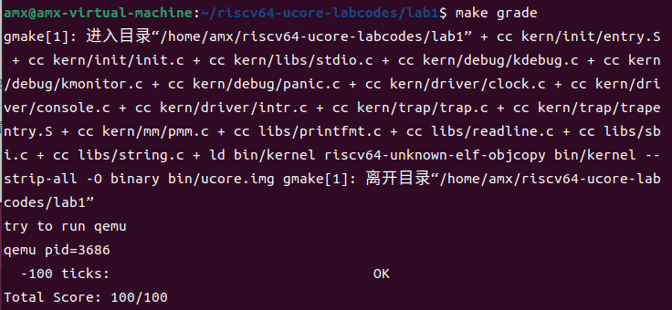

# lab1 实验报告
## 练习1：理解内核启动中的程序入口操作
+ 题目：阅读 kern/init/entry.S 内容代码，结合操作系统内核启动流程，说明指令 la sp, bootstacktop 完成了什么操作，目的是什么？tail kern_init 完成了什么操作，目的是什么？
+ **la sp, bootstacktop**
  + 完成的操作：这个汇编指令是将栈指针（Stack Pointer）设置为bootstacktop的地址，即.global bootstacktop所定义的bootstacktop标签的地址。
  + 目的：这个操作通常在操作系统内核启动过程中用于设置初始的栈顶位置。具体来说，栈作为存储函数调用的局部变量和执行上下文信息的存储结构，需要栈指针的配合，用于指示了当前栈的顶部位置。因此通过将栈指针设置为bootstacktop的地址，确保了操作系统在内核启动过程中使用的栈空间被正确初始化。
+ **tail kern_init**
  + 完成的操作：这个汇编指令是表示跳转到名为kern_init的函数。（该函数定义在同目录下的init.c文件中）
  + 目的：kern_init是操作系统内核初始化的入口点，通过跳转到这个函数，操作系统可以执行各种初始化任务。
## 练习2：完善中断处理（需要编程）
+ 代码内容：
```c
    ticks++;
    clock_set_next_event();
    if(ticks == 100){
        cprintf("100 ticks\n");
        ticks = 0;
        num++;
        }
        if(num == 10)
        {
            sbi_shutdown();
        }
```
+ 运行结果

+ 实现过程
  1. 设置下次时钟中断- clock_set_next_event()；
  2. 计数器（ticks）加一；
  3. 当计数器加到100的时候，输出一个`100 ticks`表示我们触发了100次时钟中断，计数器清零，打印次数（num）加一；
  4. 判断打印次数，当打印次数为10时，调用<sbi.h>中的关机函数关机。
+ 定时器中断处理的流程
  1. 中断触发：定时器硬件触发了中断。
  2. 中断处理程序调用：当定时器中断发生时，中断处理函数interrupt_handler被调用，传入一个包含中断信息的参数tf，其类型为trapframe结构体指针，用于保存中断时的寄存器状态和相关信息。
  3. 中断原因判断：在interrupt_handler函数中，根据中断原因cause进行判断，以确定是哪种类型的中断。在这里，是IRQ_S_TIMER类型的中断。
  4. 进行具体的时钟中断处理，即执行case为IRQ_S_TIMER的语句。
  5. 中断处理结束：中断处理程序interrupt_handler执行结束，然后返回到中断发生时的上下文，硬件会恢复中断前的寄存器状态，然后继续执行中断发生点之后的指令。

## 扩展练习 Challenge1：描述与理解中断流程
+ 处理中断异常的流程（从异常的产生开始）
  1. 中断异常产生
  2. 进入中断入口点
  3. 保存上下文
  4. a0寄存器传递参数给接下来调用的函数trap
  5. 调用trap函数处理中断异常
  6. trap函数处理完后，执行__trapret里面的内容，恢复上下文
  7. 从中断或异常处理程序返回到用户模式，从用户模式的返回地址开始执行指令，并在用户模式下继续程序执行。
+ mov a0，sp
  + 操作：将当前的栈指针的值复制到寄存器a0中。
  + 目的：为了在异常处理过程中方便地访问和备份栈指针的值，以确保异常处理程序能够正确地执行并在处理完异常后返回到正常的执行流程。
+ SAVE_ALL中寄存器保存在栈中的位置是什么确定的？
  + 在 SAVE_ALL 中，寄存器保存在栈中的位置是根据REGBYTES的大小来确定的，并且按照顺序，以一定偏移量进行排列。具体来说：
    + x0 寄存器保存在 0*REGBYTES(sp) 的位置。
    + x1 寄存器保存在 1*REGBYTES(sp) 的位置。
    + x3 寄存器保存在 3*REGBYTES(sp) 的位置。
    + 以此类推，直到 x31 寄存器保存在 31*REGBYTES(sp) 的位置。
  + REGBYTES应该是一个常量，表示一个寄存器的字节大小。经过追踪，发现它定义在riscv.h中，根据目标处理器的位数有所不同，具体代码如下。
  ```c
    #if __riscv_xlen == 64
    # define SLL32    sllw
    # define STORE    sd
    # define LOAD     ld
    # define LWU      lwu
    # define LOG_REGBYTES 3
    #else
    # define SLL32    sll
    # define STORE    sw
    # define LOAD     lw
    # define LWU      lw
    # define LOG_REGBYTES 2
    #endif
    #define REGBYTES (1 << LOG_REGBYTES)
  ```
+ 对于任何中断，__alltraps中都需要保存所有寄存器吗？NO
  1. 不同类型的中断可能需要不同的寄存器保存策略。例如，一般的时钟中断可能只需要保存一般用途寄存器和程序计数器，因为它的中断处理程序通常比较简单。然而，硬件故障中断或异常可能需要保存更多的寄存器，以便进行错误处理和调试。
  2. 在某些情况下，为了提高性能，可能会采用一种更轻量级的寄存器保存策略。这就很可能会涉及到只保存和恢复必要的寄存器，以减少中断处理的开销。
  3. 最终的决策可能还取决于中断处理程序的具体需求。某些中断处理程序可能只需要访问一小部分寄存器，而其他可能需要访问更多的寄存器来执行其任务。
## 扩增练习 Challenge2：理解上下文切换机制
+ **csrw sscratch, sp**：
  + 目的：将栈指针sp的值写入sscratch控制寄存器，这是保存整个中断上下文的一部分。保存当前中断处理过程中的栈指针，以便在中断处理程序完成后能够恢复到正确的栈。
+ **csrrw s0, sscratch, x0**：
  + 目的：将sscratch控制寄存器的值写入通用寄存器s0，同时将x0（通常情况下x0寄存器的值为0）的值写入sscratch控制寄存器。
  + 意义：前者的是将sscratch保留在通用寄存器s0中，以便在中断处理程序中可以随时访问它，而不会丢失原始值。后者的是将sscratch寄存器清零，以便如果发生递归异常，使得异常向量知道它来自内核。
+ **save all里面保存了stval、scause这些csr，而在restore all里面却不还原它们？那这样store的意义何在呢？**
  + 在RESTORE_ALL宏中，并没有还原stval和scause寄存器。这是因为在处理异常或中断时，stval和scause寄存器通常用于传递有关异常或中断的信息，例如导致异常的地址和异常原因。一旦异常或中断处理完成，它们的值就不再具有特定的意义，因此不需要还原它们。
  + 注：代码中没有看到对stval的存储，这是因为stval寄存器通常不需要在异常处理期间保存和还原。它的值通常是在异常处理程序中直接从硬件异常原因中读取，然后在需要时使用，而不是保存在上下文中。当发生内存访问异常时，硬件会将异常的目标地址存储在stval寄存器中，然后可以在异常处理程序中读取它以了解异常的原因。所以，不需要显式地保存和还原stval寄存器，它在异常处理期间会自动维护。
  + 补充一段对于stval的描述：当陷入S模式时，stval被写入特定于异常的信息，以协助软件处理该异常。否则，不会写入stval，尽管软件可以明确写入它。硬件平台将指定哪些异常必须设置stval的信息，哪些可以无条件地将其设置为零。当触发硬件断点，或者发生指令获取、加载、存储地址不对齐、访问或页故障异常时，stval被写入故障的虚拟地址。对于非法指令陷入，stval可能会根据下面描述的错误指令的前XLEN或ILEN位被写入。对于其他异常，stval被设置为零，但将来的标准可能会重新定义其他异常的stval设置。
## 扩展练习 Challenge3：完善异常中断
  + 问题：编程完善在触发一条非法指令异常mret和，在kern/trap/trap.c的异常处理函数中捕获，并对其进行处理，简单输出异常类型和异常指令触发地址，即"Illegal instruction caught at 0x(地址)"，"ebreak caught at 0x（地址）"与"Exception type:Illegal instruction"，"Exception type: breakpoint"。
  + 代码片段如下：
    ```c
    case CAUSE_ILLEGAL_INSTRUCTION:
        // 非法指令异常处理
        /* LAB1 CHALLENGE3   YOUR CODE :2111033 2113826 2113831  */
        /*(1)输出指令异常类型（ Illegal instruction）
          *(2)输出异常指令地址
          *(3)更新 tf->epc寄存器
        */
        cprintf("Illegal instruction caught at 0x%08x\n",tf->epc);
        cprintf("Exception type:Illegal instruction\n");
        tf->epc += 4;
        break;
    case CAUSE_BREAKPOINT:
        //断点异常处理
        /* LAB1 CHALLLENGE3   YOUR CODE :2111033 2113826 2113831  */
        /*(1)输出指令异常类型（ breakpoint）
          *(2)输出异常指令地址
          *(3)更新 tf->epc寄存器
        */
        cprintf("ebreak caught at 0x%08x\n",tf->epc);
        cprintf("Exception type:breakpoint\n");
        tf->epc += 4;
        break;
    ```
  + 对%08x占位符的解释：
    + %：格式化字符串通常以百分号 % 开始。
    + 0：这表示用零填充。如果要求的输出位数不足8位，将使用零来填充。如果没有这个选项，通常使用空格进行填充。
    + 8：这表示要输出的总宽度为8个字符。如果转换后的文本不够8个字符，将使用填充字符进行填充。
    + x：这表示要进行十六进制的输出。
  + 对tf->epc += 4的解释：
    + 一条指令为32位，即4个字节，在此进行pc+4，即为将pc更新为非法指令下一条指令，然后在restore的时候传给pc，以在顺序执行中跳过了非法指令。
## 实验知识点总结
### 异常和中断的区别
  + 在RISCV里，中断 (interrupt)和异常(exception) 统称为”trap”：
    + “异常”指代在当前的RISC-V处理器中与运行时指令相关的不寻常条件发生。
    + “中断”指代可能导致RISC-V处理器经历意外控制转移的外部异步事件。
    + “陷阱”指代由异常或中断引起的控制转移到陷阱处理程序的过程。
### 保存上下文中那些特殊的寄存器
  + Supervisor Status Register (sstatus)：
    + sstatus寄存器是特权级别寄存器，用于保存当前处理器状态的信息。
    + **SIE位**控制是否允许在监管模式下处理中断。当SIE被清除时，在监管模式下不会接受中断。当hart运行在用户模式时，SIE中的值被忽略，允许启用监管级别中断。监管可以使用sie CSR禁用单个中断源。
    + **SPIE**位指示陷入监管模式之前是否启用了监管级别中断。当陷入监管模式时，SPIE被设置为SIE，而SIE被设置为0。当执行SRET指令时，SIE 被设置为SPIE，然后SPIE被设置为 1。
    + **UIE位**用于启用或禁用用户模式中断。只有在UIE被设置且hart运行在用户模式下时，才启用用户级中断。
    + **UPIE位**指示在执行用户级陷阱之前是否启用了用户级中断。当执行URET指令时，UIE被设置为UPIE，而UPIE被设置为 1。用户级中断是可选的。如果省略，则UIE和UPIE位将硬连线为零。
  + Supervisor Exception Program Counter (sepc)
    当陷入S模式时，sepc被写入被中断或发生异常的指令的虚拟地址。否则，sepc不会被写入，尽管软件可以显式写入它。
  + Supervisor Cause Register (scause)
    当陷入S模式时，scause被写入一个表示导致陷阱的事件的代码。否则，scause不会被实现写入，尽管软件可以显式写入它。
  + Supervisor Trap Value (stval) Register
    (在上方已经补充过相关讲解)
### 寄存器别名
| 寄存器名 | 别名 | 解释 | 角色 |
| ------- | ------- | ------- | ------- |
| x0 | zero | Hard-wired zero，通常用于将常量零加载到寄存器 | —— |
| x1 | ra | Return address，用于保存函数调用的返回地址，以便在函数返回时跳回正确的位置。 | Caller |
| x2 | sp | Stack pointer，指向当前栈帧的栈顶，用于管理函数调用的局部变量和临时数据。 | Callee |
| x3 | gp | Global pointer，通常用于指向全局数据区，例如全局变量和数据结构。 | —— |
| x4 | tp | Thread pointer，通常用于多线程应用程序，指向当前线程的控制块或数据结构。 | —— |
| x5 | t0 | Temporary/alternate link register，在函数调用中，可以用于暂时存储链接寄存器的值。 | Caller |
| x6-7 | t1–2 | Temporaries，可用于存储临时数据，通常不需要长时间保留。 | Caller |
| x8 | s0/fp | Saved register/frame pointer，通常用于存储前一个函数的帧指针，以便在函数返回时正确设置栈指针。 | Callee |
| x9 | s1 | Saved register，可用于存储其他需要保留的寄存器值。 | Callee |
| x10-11 | a0–1 | Function arguments/return values，用于传递函数参数和接收函数返回值。 | Caller |
| x12-17 | a2–7 | Function arguments，用于传递函数参数和。 | Caller |
| x18-27 | s2–11 | Saved registers，可用于长期保存寄存器值，以便在需要时进行恢复。 | Callee |
| x28-31 | t3–6 | Temporaries，可用于存储临时数据，通常不需要长时间保留。 | Caller |
+ 注：其中角色一栏，是指寄存器通常有两个角色：Caller和Callee。这两个角色是在函数调用和函数执行期间负责寄存器的保存和恢复的角色。
  1. **Caller（调用者）**：Caller是调用函数的代码，通常在函数调用之前执行，负责将函数参数传递给被调用函数，并保存必须在函数调用之后继续使用的寄存器的值。
  2. **Callee（被调用者）**：Callee是被调用的函数，通常在函数调用内执行，负责执行函数的任务，包括使用传递的参数和执行其他计算，以便在函数执行期间可以自由使用这些寄存器，但必须在函数返回之前正确恢复它们的值。
  总之，Caller 和 Callee 角色有助于确保函数调用期间寄存器状态的正确管理，以及在函数调用结束后程序状态的正确恢复。